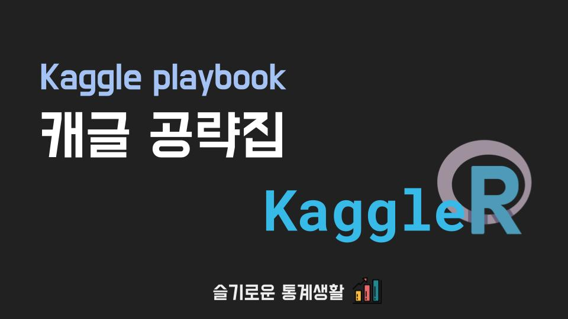

```{r setup, include=FALSE}
knitr::opts_chunk$set(echo = FALSE)

# Learn more about creating websites with Distill at:
# https://rstudio.github.io/distill/website.html

# Learn more about publishing to GitHub Pages at:
# https://rstudio.github.io/distill/publish_website.html#github-pages

```



## 캐글러(KaggleR)들 모여라!

본 사이트는 R을 사용하여 캐글 데이터 분석경연 대회를 참여하시는 모든 분들과 정보를 공유하고자 하는 목적에서 만들게 되었습니다.

### 공략집 사용방법

오른쪽 위에 [매뉴얼](blog.html)을 클릭하시면, 다른 분들의 캐글 공략팁을 볼 수 있습니다.

### 관련 스터디 참여방법

R 사용자들의 캐글 대회 공략을 쉽게하기 위하여 [슬기로운 통계생활의 슬랙](https://join.slack.com/t/w1599413609-usp186672/shared_invite/zt-kq7sxg3m-xqD3LI2qLgh_3PE5zvYdKA)에서 정기적인 스터디를 계획 중에 있습니다. 현재 1기를 모집 중에 있으니, 참여하시고 싶으신 분들은 슬랙에 가입 후 `kaggler-with-r` 채널에 들어오시면 됩니다.

### 스터디 계획

- 1주일 1회, 1시간, 10주 목표
- 줌으로 모여 캐글 데이터로 분석 방법 공유합니다.
- 스터디 참여원은 최소 1번의 발표를 진행합니다.
- 만료된 쉬운 대회를 선정하여 차차 어려운 대회를 진행하려 합니다.
- 다른 대회들에 있어서의 코드 재사용을 높히기 위하여 스터디의 내용을 코드북(Code book)화 시키려고 합니다.